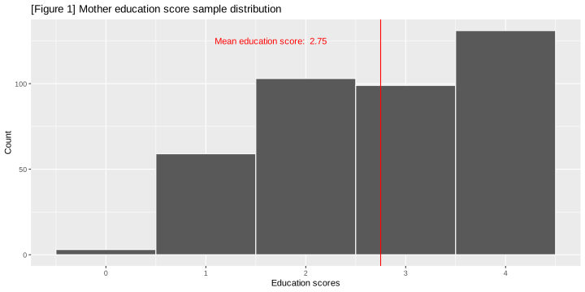
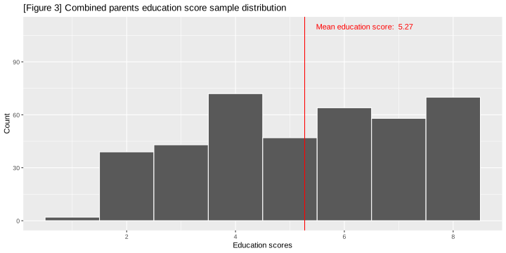
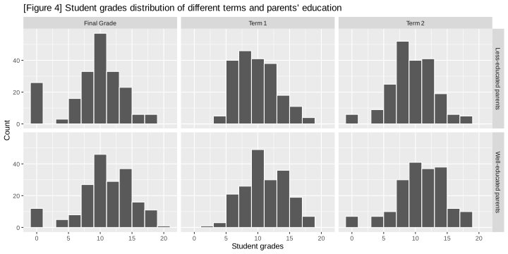
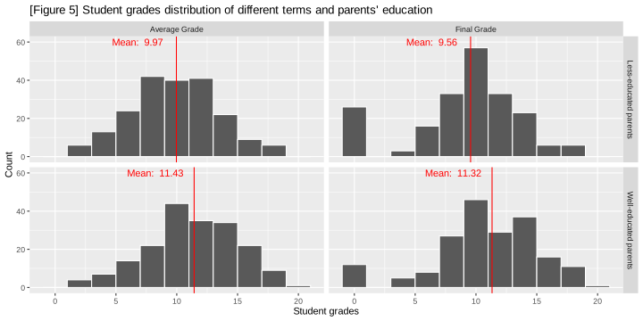
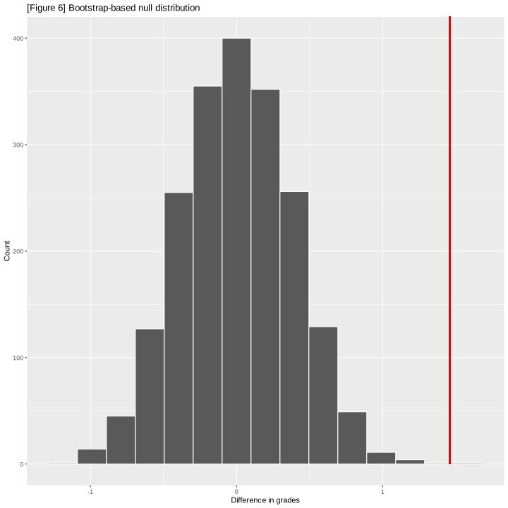
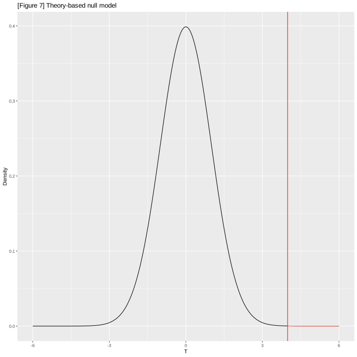

# Parents' Educational Attainment and Children's Intellectual Development

### Sections
- #### [Introduction](#intro)
    - ##### [Preliminary Analysis](#Prelim)
- #### [Methods and Results](#Methods)
    - ##### [Bootstrap-based approach](#boot)
    - ##### [Theory-based approach](#theory)
- #### [Discussion](#discuss)
- #### [References](#refer)

# Introduction <a id = 'intro'>
Student Performance is a general term used to describe how well a student has mastered what is taught in school. In our experiment, we will use students' grades to quantify student performance and ultimately intellect. Although countless factors contribute to a student's academic performance, for simplicity we will assume performance on mathematics is representative of the student's performance; a study published in 2019 [(Mammarella et al., 2019)](#ref_2) explores the impact of parents' attitudes and behaviors towards math on their child's mathematic performance. There was evidence that parents majoring in elementary education tend to have higher math anxiety than those attending college. Another study [(Muhammad et al., 2020)](#ref_3) also suggests that the high education of father and mother positively contributes to their children's academic achievement. Our research is inspired by these findings, aiming to investigate the relationship between parental education and the child's mathematic performance.

The dataset [(2014)](#ref_1) that will be used in this project is the Student Performance on Math dataset from the UCI machine learning repository. This project will conduct a hypothesis test to determine whether the difference between the mean (mathematic) student performance of "well-educated" and "less-educated" parents is statistically significant. The classification of parents’ level of education is determined in the preliminary analysis. The measured student performance is reflected in grades on a numeric scale from $0$ to $20$. 

### Research Question:
Is the mean (mathematic) student performance of those with well-educated parents greater than that of those with less-education parents?

$H_0: \mu_1 - \mu_2 = 0$

$H_a: \mu_1 - \mu_2 > 0$

$\mu_1$: Mean student performance of well-educated parents’ group.

$\mu_2$: Student performance of less-educated parents’ group. 

The hypothesis test will be conducted at a significance level of $\alpha = 1$%.

### Preliminary Analysis <a id = 'Prelim'>
This section will involve:
- Reading data from UCI database
- Wrangling, analyzing, and plotting relevant data
    - [Classifying parents' education](#parents)
    - [Wrangling student's grades](#students)
- Computing point estimates


```R
# load libraries and set seed
set.seed(8888)
library(tidyverse)
library(tidymodels)
library(infer)
```

### Reading and Cleaning Data from Database


```R
# Reading data from UCI Machine Learning Repository and extract CSV file from zip file
url <- "https://archive.ics.uci.edu/static/public/320/student+performance.zip"
download.file(url, "./data/studentperformance.zip")
raw_data <- unzip("./data/studentperformance.zip", "student.zip", exdir = "./data") |>
    unzip("student-mat.csv", exdir = "./data") |>
    read_delim(delim = ";")

# Refactoring column names
student_data <- raw_data |>
    select(Medu, Fedu, G1, G2, G3)
colnames(student_data) <- c("mother_education", "father_education", "term_1_grade", "term_2_grade", "final_grade")

cat("[Table 1] Unwrangled student data with relevant variables")
head(student_data)
```

	[Table 1] Unwrangled student data with relevant variables


<table class="dataframe">
<caption>A tibble: 6 × 5</caption>
<thead>
	<tr><th scope=col>mother_education</th><th scope=col>father_education</th><th scope=col>term_1_grade</th><th scope=col>term_2_grade</th><th scope=col>final_grade</th></tr>
	<tr><th scope=col>&lt;dbl&gt;</th><th scope=col>&lt;dbl&gt;</th><th scope=col>&lt;dbl&gt;</th><th scope=col>&lt;dbl&gt;</th><th scope=col>&lt;dbl&gt;</th></tr>
</thead>
<tbody>
	<tr><td>4</td><td>4</td><td> 5</td><td> 6</td><td> 6</td></tr>
	<tr><td>1</td><td>1</td><td> 5</td><td> 5</td><td> 6</td></tr>
	<tr><td>1</td><td>1</td><td> 7</td><td> 8</td><td>10</td></tr>
	<tr><td>4</td><td>2</td><td>15</td><td>14</td><td>15</td></tr>
	<tr><td>3</td><td>3</td><td> 6</td><td>10</td><td>10</td></tr>
	<tr><td>4</td><td>3</td><td>15</td><td>15</td><td>15</td></tr>
</tbody>
</table>


### Wrangling, Analyzing, and Plotting Data

#### Classifying parents' education <a id='parents'></a>

Seen from documentation of the dataset [(2014)](#ref_1), the mother's and father's education levels are as follows:

	[Table 2] Education Level Explanation
|Score|Education level|
|-|-|
|$0$|None|
|$1$|up to 4th grade|
|$2$|5th to 9th grade|
|$3$|Secondary education|
|$4$|Postsecondary education|


Below are plots of the distribution of the parents' education scores by assuming the score as numeric rather than categorical:


```R
options(repr.plot.width = 10, repr.plot.height = 5)

# Plot education scores of mothers
mother_education_plot <- student_data |>
    ggplot(aes(x = mother_education)) +
    geom_histogram(binwidth = 1, color = 'white') +
    geom_vline(aes(xintercept = mean(mother_education)), color = 'red') +
    annotate("text", label = paste("Mean education score: ", round(mean(student_data$mother_education), digits = 2)), 
             x = mean(student_data$mother_education) - 1.1, y = 125, color = 'red') +
    ggtitle("[Figure 1] Mother education score sample distribution") +
    xlab("Education scores") +
    ylab("Count") +
    labs()

# Plot educations scores of fathers
father_education_plot <- student_data |>
    ggplot(aes(x = father_education)) +
    geom_histogram(binwidth = 1, color = 'white') +
    geom_vline(aes(xintercept = mean(father_education)), color = 'red') +
    annotate("text", label = paste("Mean education score: ", round(mean(student_data$father_education), digits = 2)), 
             x = mean(student_data$father_education) + 1.1, y = 110, color = 'red') +
    ggtitle("[Figure 2] Father education score sample distribution") +
    xlab("Education scores") +
    ylab("Count")

mother_education_plot
father_education_plot
```


    

    


    

    


From the plots above, figure $1$ and $2$, it can be observed that they differ slightly in the shape, but otherwise share similar characteristics; there are very little observations of parents with "no education level" and most of the observations tend towards the upper end of the scale with both centers being about $2$ to $3$.

With consideration of the fact that they share similar centers, the education scores of the respective parents are summed under the assumption that the individual parent education scores along with the sex of the parent are not respectively significant (e.g. father and mother with score of $5$ and $5$ vs. $1$ and $9$ vs. $9$ and $1$ are equivalent). Under this assumption, the process of classifying "well-educated" and "less-educated" parents is simplified and more generalized without further research beyond the scope of statistics.

Below is the distribution of the combined parents' education scores:


```R
# Combine parents education scores
student_data_combined_edu <- student_data |>
    mutate(combined_education = father_education + mother_education)

# Plot combined education scores
combined_education_plot <- student_data_combined_edu |>
    ggplot(aes(x = combined_education)) +
    geom_histogram(binwidth = 1, color = 'white') +
    geom_vline(aes(xintercept = mean(combined_education)), color = 'red') +
    annotate("text", label = paste("Mean education score: ", round(mean(student_data_combined_edu$combined_education), digits = 2)), 
             x = mean(student_data_combined_edu$combined_education) + 1.1, y = 110, color = 'red') +
    ggtitle("[Figure 3] Combined parents education score sample distribution") +
    xlab("Education scores") +
    ylab("Count")

combined_education_plot
```


    

    


Without additional context from the data, it is unreasonable to assume any educational standards, e.g. "high school should be the minimum education". Therefore, to avoid further assumptions about the educational standards of this data's origin, the description representing each score will be disregarded and the scores will be solely treated as numeric values. As such, the parents' education would then be classified by splitting at the median to obtain a roughly equal split. Although the median may not be the only way to split and classify, it avoids most assumptions about the extent of "well-educated" and is a more generalizable approach.


```R
# Find median value
split <- quantile(student_data_combined_edu$combined_education, 0.5)

# Split and classify
student_data_classified_edu <- student_data_combined_edu |>
    mutate(parents_education = ifelse(combined_education <= split, "less", "well")) |>
    select(term_1_grade, term_2_grade, final_grade, parents_education)

# Overview of split groups
cat("[Table 3] Count for Each Group")
student_data_classified_edu |>
    group_by(parents_education) |>
    summarize(n = n())
```

	[Table 3] Count for Each Group


<table class="dataframe">
<caption>A tibble: 2 × 2</caption>
<thead>
	<tr><th scope=col>parents_education</th><th scope=col>n</th></tr>
	<tr><th scope=col>&lt;chr&gt;</th><th scope=col>&lt;int&gt;</th></tr>
</thead>
<tbody>
	<tr><td>less</td><td>203</td></tr>
	<tr><td>well</td><td>192</td></tr>
</tbody>
</table>


#### Wrangling student's grades <a id='students'></a>

Referring again to the documentation [(1)](#ref_1), all three of a student's grades are integers in the interval $[0, 20]$.

Below are plots of the distribution of students' first, second, and final grades grouped by the parents' education classification found above:


```R
options(repr.plot.width = 10, repr.plot.height = 5)

# Labels for facet_grid
labels <- c(`term_1_grade` = "Term 1", `term_2_grade` = "Term 2", `final_grade` = "Final Grade",
           `less` = "Less-educated parents", `well` = "Well-educated parents")

# Plot all grades along with parents' education
student_grade_plots <- student_data_classified_edu |>
    pivot_longer(names_to = "term", values_to = "grade", cols = c(term_1_grade, term_2_grade, final_grade)) |>
    ggplot(aes(x = grade)) +
    facet_grid(rows = vars(parents_education), cols = vars(term), labeller = as_labeller(labels)) +
    geom_histogram(binwidth = 2, color = 'white') +
    ggtitle("[Figure 4] Student grades distribution of different terms and parents' education") +
    xlab("Student grades") +
    ylab("Count")

student_grade_plots
```


    

    


Seen from the figure $4$ above, it seems that most of the distributions seem somewhat normal with center around $10$. However, looking at `Final Grade` and `Term 2` for both groups of parents, there appears to be an increasing frequency for grades of $0$. Below is an overview of those with a final grade of $0$:


```R
# Observe students with a final grade of 0
cat("[Table 4] Zero Final Grade Overview")
student_data_classified_edu |>
    filter(final_grade == 0) |>
    mutate(average_term_grades = (term_1_grade + term_2_grade)/2) |>
    select(term_1_grade, term_2_grade, final_grade) |>
    head(10)
```

	[Table 4] Zero Final Grade Overview


<table class="dataframe">
<caption>A tibble: 10 × 3</caption>
<thead>
	<tr><th scope=col>term_1_grade</th><th scope=col>term_2_grade</th><th scope=col>final_grade</th></tr>
	<tr><th scope=col>&lt;dbl&gt;</th><th scope=col>&lt;dbl&gt;</th><th scope=col>&lt;dbl&gt;</th></tr>
</thead>
<tbody>
	<tr><td> 7</td><td>4</td><td>0</td></tr>
	<tr><td>12</td><td>0</td><td>0</td></tr>
	<tr><td> 8</td><td>0</td><td>0</td></tr>
	<tr><td> 9</td><td>0</td><td>0</td></tr>
	<tr><td>11</td><td>0</td><td>0</td></tr>
	<tr><td>10</td><td>0</td><td>0</td></tr>
	<tr><td> 4</td><td>0</td><td>0</td></tr>
	<tr><td> 7</td><td>9</td><td>0</td></tr>
	<tr><td> 5</td><td>0</td><td>0</td></tr>
	<tr><td> 6</td><td>7</td><td>0</td></tr>
</tbody>
</table>


Observing the overview, it can be seen from a general glance that those with a final grade of $0$ tend to also have "relatively poorer" grades in the preceding two terms. As the significance of $0$ wasn't documented in the original data, it's difficult to determine whether it represents missing/null data or other holistic factors such as failing by not reaching a certain cutoff. Due to this uncertainty, the mean of all three grades will be used to represents the student's grade to mitigate severe skewness. Below are the distributions of the final grades and the average grades of students with respect to parents' education:


```R
# Find average grades
student_data_average <- student_data_classified_edu |>
    mutate(average_grade = (term_1_grade + term_2_grade + final_grade) / 3)

# Labels for facet_grid
labels2 <- c(`average_grade` = "Average Grade", `final_grade` = "Final Grade",
           `less` = "Less-educated parents", `well` = "Well-educated parents")

# Find averages for respective distributions
averages <- student_data_average |>
    group_by(parents_education) |>
    summarize(final_grade = mean(final_grade), average_grade = mean(average_grade)) |>
    pivot_longer(names_to = "type", values_to = "grade", cols = c(final_grade, average_grade)) |>
    mutate(lab = paste("Mean: ", round(grade, digits = 2)), x = grade - 3.2, y = 60)

# Plot final grades only vs. average grades
student_final_vs_average_grades_plot <- student_data_average |>
    pivot_longer(names_to = "type", values_to = "grade", cols = c(final_grade, average_grade)) |>
    ggplot(aes(x = grade)) +
    facet_grid(rows = vars(parents_education), cols = vars(type), labeller = as_labeller(labels2)) +
    geom_histogram(binwidth = 2, color = 'white') +
    geom_vline(data = averages, aes(xintercept = grade), color = "red") +
    geom_text(data = averages, color = "red", aes(x = x, y = y, label = lab)) +
    ggtitle("[Figure 5] Student grades distribution of different terms and parents' education") +
    xlab("Student grades") +
    ylab("Count")

student_final_vs_average_grades_plot
```


    

    


Comparing the distributions seen in figure $5$, the centers with respect to the parents' education seems to be similar while the average grade does not appear to have any outliers. In addition, the spread of the distributions appears similar. Due to the absence of outliers (i.e. the $0$ seen in final grade), it is reasonable to continue the analysis by using the average grade to avoid further assumptions.

**Note**: when referring to the documentations [(1)](#ref_1), it should be mentioned that the students have been sampled from two different schools, which may give rise to bias from different schooling environments. However, our goal is to test parental education levels, so it is assumed that this confounding variable is trivial.

# Methods and Results <a id='Methods'>

### Hypothesis Test

As previously stated in the [introduction](#intro), our hypothesis test are as follows:

Null hypothesis $H_0: \mu_1 - \mu_2 = 0$

Alternative hypothesis $H_a: \mu_1 - \mu_2 > 0$

$\mu_1$: Mean student (mathematic) performance of well-educated parents’ group.

$\mu_2$: Mean student (mathematic) performance of less-educated parents’ group. 

Significance level $\alpha = 1\$% or $0.01$.

This hypothesis test will be tested with two approaches: [bootstrap-based](#boot) and [asymptotic](#theory). By conducting the same hypothesis test through different methods, obtaining consistent results from both indicates that the results are likely reliable in terms of code and testing process.

### Bootstrap-based Hypothesis Test <a id = 'boot'>

The assumptions to conducting a bootstrap-based hypothesis test is are as follows:
- The sample(s) are representative of the population(s).
- The sample(s) are large enough to produce a reliable bootstrap distribution.
    
Below is the hypothesis test conducted with a bootstrap-based approach:


```R
# Increase height for better visualization
options(repr.plot.width = 10, repr.plot.height = 10, scipen = 2)

student_data_final <- student_data_average |>
    select(average_grade, parents_education)

# Calculate observed test statistic
obs_stat <- student_data_final |>
    specify(average_grade ~ parents_education) |>
    calculate(stat = "diff in means", order = c("well", "less"))

# Generate null model
null_model_boot <- specify(student_data_final, formula = average_grade ~ parents_education) |>
    hypothesize(null = "independence") |>
    generate(type = "permute", reps = 2000) |>
    calculate(stat = "diff in means", order = c("well", "less"))

# Visualize
null_model_boot |> visualize() + 
    shade_p_value(obs_stat, direction = "greater", size = 1) +
    ggtitle("[Figure 6] Bootstrap-based null distribution") +
    xlab("Difference in grades") +
    ylab("Count")

# Output p-value
cat(paste("P-Value for bootstrap-based hypothesis test: ", get_p_value(null_model_boot, obs_stat, direction = "greater")))
```

	P-Value for bootstrap-based hypothesis test:  0.0005


    

    


Given that the p-value ($0.0005$) is less than our set significance level, there is sufficient evidence to reject the null hypothesis $H_0$. The obtained p-value from the bootstrap-based hypothesis test indicates there is a statistically significant difference between the mathematical performance of students with "well-educated" parents and that of those with "less-educated" parents. 

### Asymptotic Theory-based Hypothesis Test <a id = 'theory'>

In order to conduct the hypothesis test via asymptotic theory, the following assumptions are made (central limit theorem):
- The sample(s) are randomly obtained.
- The sample size(s) are independent (less than $10\%$ of the population size(s))
- The population distribution for the average grades is normal *or* the sample size is large enough for the parents' education groups respectively.

Additionally, since the population standard deviation is unknown, the null model will be t-distribution with the calculated degree of freedom for two samples, and the p-value is calculated with that null model. Alternatively, the test for theory-based approach is called `two-sample t-test`.
    
Below is the hypothesis test conducted with an asymptotic-based approach:


```R
# Find statistics of student grades of "less-educated" and "well-educated" parents
less_stat <- student_data_final |>
    filter(parents_education == "less") |>
    summarize(n = n(), mean = mean(average_grade), sd = sd(average_grade))

well_stat <- student_data_final |>
    filter(parents_education == "well") |>
    summarize(n = n(), mean = mean(average_grade), sd = sd(average_grade))

cat("[Table 5] Statistics of less-educated group")
less_stat
cat("[Table 6] Statistics of well-educated group")
well_stat

# Calculate the degree of freedom for null model
df <- (less_stat$sd^2 / less_stat$n + well_stat$sd^2 / well_stat$n)^2 /
      (less_stat$sd^4 / (less_stat$n^2 * (less_stat$n - 1)) + well_stat$sd^4 / (well_stat$n^2 * (well_stat$n - 1)))

plot_range <- tibble(lower = -6, upper = 6)

# Generate null model
null_model_theory <- tibble(t = seq(from = plot_range$lower, to = plot_range$upper, by = 0.01), density = dt(t, df))

# Calculate test statistic
test_stat <- (well_stat$mean - less_stat$mean)/sqrt(well_stat$sd^2/well_stat$n + less_stat$sd^2/less_stat$n)

# Plot null model
ggplot(null_model_theory) + 
    geom_line(aes(x = t, y = density)) + 
    geom_ribbon(data = subset(null_model_theory, t > test_stat & t < plot_range$upper), 
                mapping = aes(x = t, ymax = density, fill = "red", color = "red"), ymin = 0, alpha = 0.3) +
    geom_vline(aes(xintercept = test_stat), color = 'red') +
    theme(legend.position="none") +
    ggtitle("[Figure 7] Theory-based null model") +
    xlab("T") +
    ylab("Density")
    

# Output p-value
cat(paste("P-Value for theory-based hypothesis test: "), pull(tibble(p_value = pt(test_stat, df, lower.tail = F))))
```

	[Table 5] Statistics of less-educated group


<table class="dataframe">
<caption>A tibble: 1 × 3</caption>
<thead>
	<tr><th scope=col>n</th><th scope=col>mean</th><th scope=col>sd</th></tr>
	<tr><th scope=col>&lt;int&gt;</th><th scope=col>&lt;dbl&gt;</th><th scope=col>&lt;dbl&gt;</th></tr>
</thead>
<tbody>
	<tr><td>203</td><td>9.970443</td><td>3.544345</td></tr>
</tbody>
</table>


    [Table 6] Statistics of well-educated group


<table class="dataframe">
<caption>A tibble: 1 × 3</caption>
<thead>
	<tr><th scope=col>n</th><th scope=col>mean</th><th scope=col>sd</th></tr>
	<tr><th scope=col>&lt;int&gt;</th><th scope=col>&lt;dbl&gt;</th><th scope=col>&lt;dbl&gt;</th></tr>
</thead>
<tbody>
	<tr><td>192</td><td>11.42882</td><td>3.7157</td></tr>
</tbody>
</table>


	P-Value for theory-based hypothesis test:  0.00003995373


    

    


Likewise, the p-value ($\approx0.00004$) is less than the significance level, indicating there is sufficient evidence to reject the null hypothesis $H_0$. This result obtained through theory-based approach is consistent with the results obtained through the bootstrap-based approach under the same significance level and data. Therefore, it is reasonable to conclude that the actual mean (mathematic) performance of students with "well-educated" parents is not equal to that of students with "less-educated" parents.

#### Comparison between bootstrapping and asymptotic theory for hypothesis testing

Despite the consistent conclusion from both approaches (rejecting the null hypothesis), the numerical results (p-value) aren't the same. The variability of the p-value can be attributed to the overall sampling randomness from performing these methods; bootstrapping involves random samples and thus variation in the mean differences, whereas asymptotic theory provides an estimation of the sampling distribution with uncertainty in the truth of the assumptions made (central limit theorem). 

This variation in p-value in this analysis is trivial in comparison to the significance level, however, it brings attention to the reliability of the approaches. Through many adjustments, the bootstrapping method often yielded a p-value of $0$ due to a lack of bootstrapped measurements near such an extreme test statistic to generate any "area". In spite of the frequent null p-values, bootstrapping can be considered more "trustworthy" in this analysis, as the lack of information regarding the origin of the whole data can create doubt about the assumptions made for the asymptotic theory. Conversely, the asymptotic theory is more "numerically reliable", as it is mathematically impossible to yield a flat p-value of $0$.

# Discussion <a id='discuss'>

#### Possible Errors
Given that both of our methods have led us to reject the null hypothesis, there exists a possibility of a Type I error having occurred. To effectively manage this risk, we can consider two strategies. Firstly, we could further lower the significance level, although our current significance level is already set at a relatively stringent 1%. Aternatively, increasing the sample size.  Modifying the significance level would make the result more stringent in the criteria for rejecting the null hypothesis. Alternatively, expanding the sample size holds the advantage of enhancing the statistical power, thereby reducing the likelihood of erroneously rejecting the null hypothesis. 
    
#### Confounding Variables
The  consideration of unaccounted variables within our analysis is significant. One such variable that our analysis might overlook is the parental involvement in their children’s math practices. As highlighted in the article [(Panaoura, 2017)](#ref_4), parental involvement has been recognized as a crucial factor influencing students’ academic achievement. While our study has explored the link between parents education and children’s math performance, the potential influence of parental intervention is a facet that may not have been fully considered. The act of engaging in math-related activities and providing on-hand coaching at home not only reinforces classroom learning but also cultivates a supportive learning environment. This resonates with the broader educational philosophy that acknowledges learning as a collaborative endeavor between schools, parents, and children. 
    
    
#### Conclusion     
Using thorough bootstrapping and asymptotic-based analyses in the hypothesis test, we have concluded that there is sufficient statistical evidence to suggest that the academic performance (namely mathematics) of students whose parents are better educated is greater than the academic performance of students whose parents are not educated as well.
    
From our basic background information, there was a general consensus that parent who attained higher educational achievements, fostered academically performing students. This prompted our hypothesis testing research to discover whether there existed sufficient evidence to conclude whether the parent's educational attainment affected the performance within students. 
  
Our findings provide consistent and sufficient evidence to conclude that there is a statistically greater difference between the mathematical performance of students with "well-educated" parents and that of those with less-educated parents.  Through the analyze of both a bootstrapping and asymptotical-based approach, we have determined that both approaches yielded sufficient evidence to reject our null hypothesis $H_0$.  While our research does focus on the importance of the education level of a parent, it is crucial to note that mathematical performance of students is not solely influenced by the parent's education attainment, but by a variety of many other factors.  Additionally, there also exists a non-zero chance for our research to have committed a type 1 error; however, this experiment focuses on the parental education level and the findings of our hypothesis testing.  With the consistent results of our conclusions during our hypothesis testing approaches and given our calculated p-values being less than our set significance level, we have plausible evidence to conclude that the mean (mathematic) student performance of those with well-educated parents are greater than that of those with less-education parents.

#### Future Questions/Research:
 - Subject Variation: The impact of parents' educational level on student performance may vary across different academic subjects. Our project only focuses on math performance, but it's important to consider the applicability to other subjects as well. For example, we can compare the impact of parents' educational level on student's math grade, and on other subjects' grades (e.g. Portuguese, computer science, economics), trying to find if there are any difference. 
 - Parents’ education strategies: Parents might use different strategies on children's education, and well-educated parents might use more effective education strategies on their children. For example, we can explore whether well-educated parents provide more course-related activities or not, and study the types of activities parents provide, such as puzzles, games, quiz bowl... and find if better student performance results from more logical family activities.
 - Continuing intergenerational trend of education: As the previous generations could possibly affect the academic performance of the subsequent generations, could it be possible to observe a diverging trend where the statistical effect in the difference of academic performance between lesser educated families and better educated families become even greater? In addition to this research topic, it could be possible to explore the current education systems and analyze the impact which it may have on the education of subsequent generations.

# References <a id='refer'>

1. <a id='ref_1'></a> Cortez,Paulo. (2014). Student Performance. UCI Machine Learning Repository. https://doi.org/10.24432/C5TG7T.

2. <a id='ref_2'></a> Herts, J. B., Beilock, S. L., & Levine, S. C. (2019). The role of parents’ and teachers’ math anxiety in Children’s math learning and attitudes. In I. C. Mammarella, S. Caviola & A. Dowker (Eds.), *Mathematics anxiety* (1st ed., pp. 190-210). Routledge. https://doi.org/10.4324/9780429199981-11

3. <a id='ref_3'></a> Dr. Muhammad Idris, Dr. Sajjad Hussain, & Dr. Nasir Ahmad. (2020). Relationship between Parents’ Education and their children’s Academic Achievement. Journal of Arts & Social Sciences , 7(2), 82-92. https://doi.org/10.46662/jass-vol7-iss2-2020(82-92)

4. <a id='ref_4'></a> Panaoura, A. (2017). Parental involvement in developing students‟ perseverance in solving mathematical problem through the use of social media. International Journal of Technology in Education and Science (IJTES), 1(1), 36-47. https://files.eric.ed.gov/fulltext/EJ1227483.pdf
